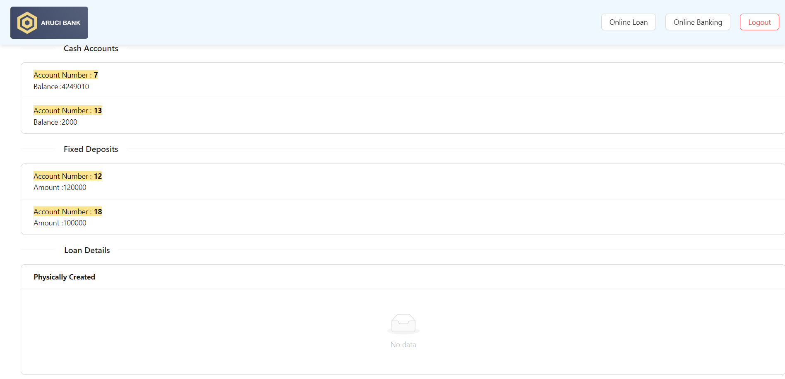
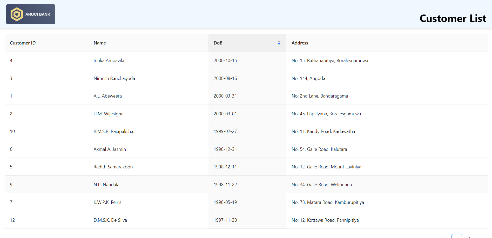
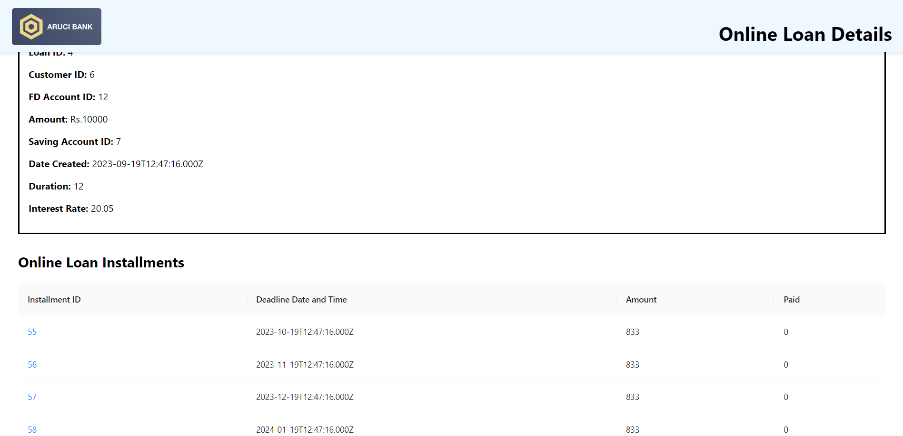

# Bank Management System using React.js, Node.js, and MySQL

## Introduction

The Bank Management System project is a comprehensive database management system developed as part of the CS3043 - Database Systems course. This system is designed to provide a user-friendly interface for managing various banking operations. It comprises a frontend built with React.js, a backend powered by Node.js, and utilizes a MySQL database to store and manage data efficiently.

## Project Overview

### Frontend (React.js)

#### User Interface
The frontend of the Bank Management System is built using React.js, a popular JavaScript library for creating interactive user interfaces. The user interface is designed to be intuitive and easy to navigate. It provides various features and functionalities that allow users to interact with the banking system seamlessly.

#### Features
1. **User Authentication:** Users can register, login, and securely manage their accounts. Proper authentication mechanisms are implemented to ensure data security.

2. **Account Overview:** Users can view their account details, including balance, transaction history, and account information.

3. **Transaction Management:** Users can perform various banking operations, such as deposit, withdrawal, fund transfer, and account statement generation.

4. **Loan Application:** Users can apply for loans and track the status of their loan applications.

5. **Profile Management:** Users can update their personal information, change passwords, and manage their contact details.

### Backend (Node.js)

#### Server and APIs
The backend of the system is built using Node.js, a server-side JavaScript runtime. It serves as the bridge between the frontend and the database, handling user requests and providing data from the MySQL database.

#### Features
1. **API Endpoints:** The backend defines a set of RESTful API endpoints to handle various user interactions and operations, such as authentication, transactions, and account management.

2. **Database Integration:** Node.js interacts with the MySQL database to retrieve and store user data, account details, transactions, and more.

3. **Security:** Robust security measures, such as data encryption, input validation, and authentication, are implemented to protect user data and ensure the integrity of the system.

4. **Logging and Error Handling:** The backend logs activities and errors to facilitate debugging and monitoring of the system.

### Database (MySQL)

#### Data Storage and Management
The MySQL database stores and manages all the data necessary for the Bank Management System. It is designed with a well-structured schema to efficiently organize information related to users, accounts, transactions, loans, and more.

#### Features
1. **Tables:** The database schema consists of tables for storing user profiles, account details, transaction records, loan information, and other relevant data.

2. **Data Integrity:** Data integrity constraints, such as foreign keys, indexes, and unique constraints, are enforced to maintain the accuracy and consistency of the data.

3. **Query Optimization:** SQL queries are optimized to ensure fast and efficient retrieval of data, especially during high traffic periods.

## Conclusion

The Bank Management System project is a collaborative effort that integrates a frontend developed with React.js, a backend powered by Node.js, and a MySQL database to provide users with a secure and user-friendly platform for banking operations. This project not only demonstrates the principles of database management but also showcases the capabilities of modern web development technologies.

## Contributors

